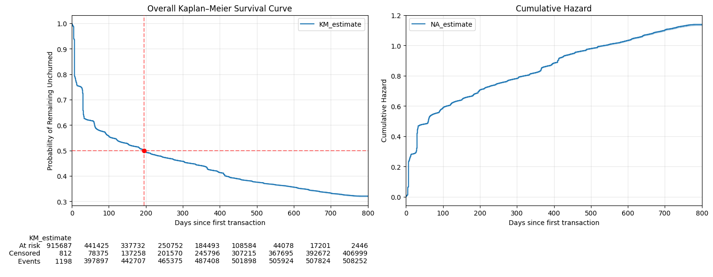
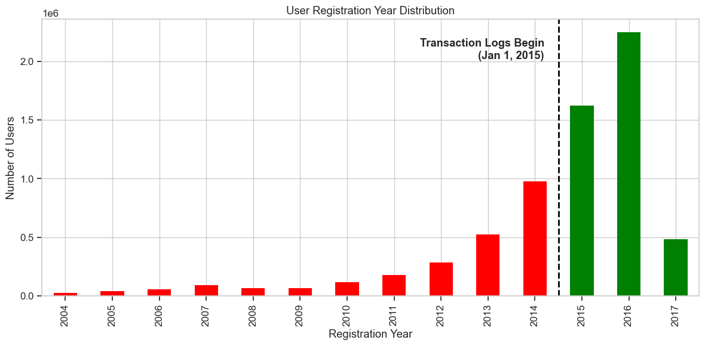
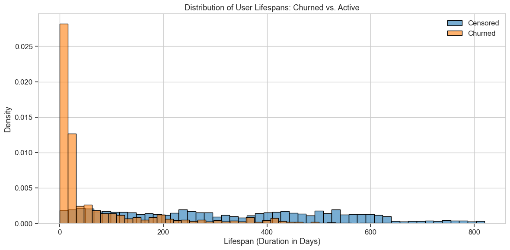
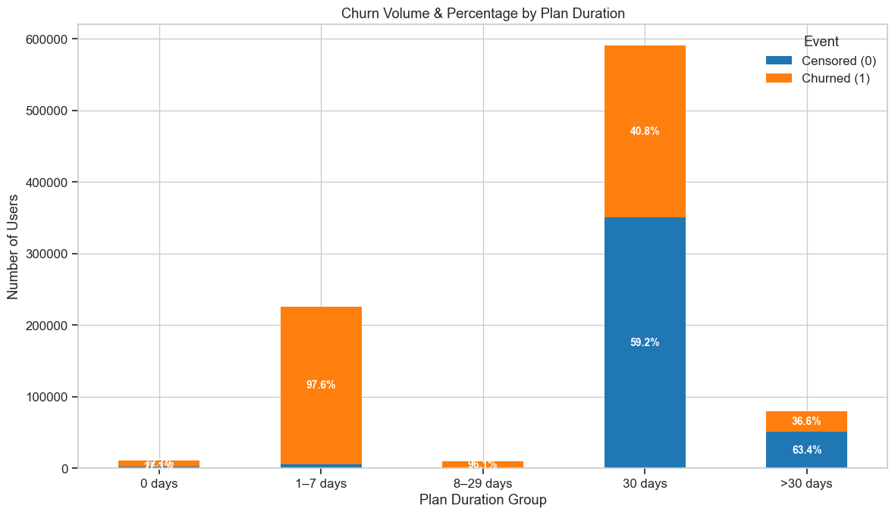
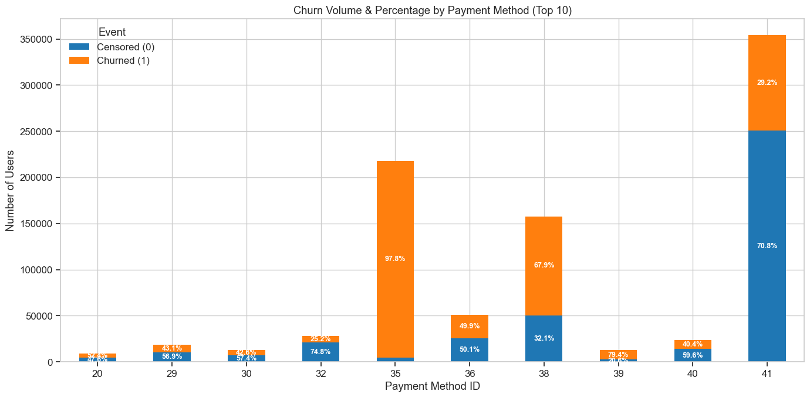
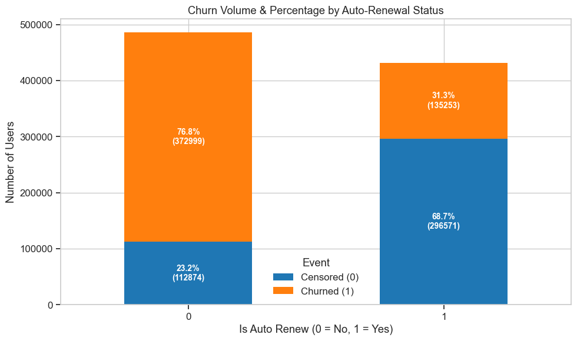

# Churn Survival Analysis: Understanding Time to Customer Churn

In this project, I explore subscriber churn using a Time-to-Event (Survival) Framework to model time to churn, which accounts for when a user churns and handles users who haven't churned by the end of the observation window (right-censoring).

The scope of this analysis is transactions-focused to isolate the impact of billing behaviours and features like Auto-Renew status, Payment Plan Duration, and Payment Methods on churn.

## Tech Stack

- Python
- Jupyter Notebooks
- pandas
- matplotlib
- seaborn
- numpy
- lifelines

## Key Findings

1. Median Survival Time

Half of the cohort churns in approximately 195 days.

2. Churn Hazard Ratios

- Regardless of a user's billing cycle or payment method, enabling auto-renewal is the single most effective retention mechanism. It reliably cuts a user's baseline churn risk by approximately 63% (HR = 0.37). Furthermore, proportional hazards assumption tests confirmed this protective effect is mathematically constant over time.

- Extending a user beyond a 30-day subscription plan cuts churn risk by 50% (HR = 0.50).

- Method 39 was consistently the most degrading payment channel. Even when accounting for plan length and auto-renewal, using Method 39 nearly quadruples a user's risk of churning (HR = 3.84). Conversely, Method 32 reliably reduced churn risk by 41% (HR = 0.59).

## Data & Definitions

This analysis uses the `transactions` and `members` datasets from WSDM - KKBox's Churn Prediction Challenge dataset

- Churn definition: A user is considered churned if their subscription expires and they do not renew within 30 days. Users who reach the end of the dataset without a full 30-day window to observe churn are treated as censored.

- Survival time origin: Each user's survival clock starts at their first transaction (first subscription), not their registration date. This measures time as a paying subscriber and excludes time spent on the free tier before converting.

- Left-Truncation: The available transaction logs begin exactly on January 1, 2015. However, millions of KKBox users registered years prior. Including these older users creates left-truncation bias because a 5-year loyal user would not be the same, nor have the same starting point as a new subscriber. To correct this, the primary cohort for the analysis is restricted to users who registered after Jan 1, 2015.

## Notebooks

- 01 — [Data Preparation](01_data_prep.ipynb)
cleans and consolidates the transaction data and constructs the final one-row-per-user survival dataset.

- 02 — [Exploratory Data Analysis](02_eda.ipynb)
explores cohort composition, retention patterns and characteristics associated with observed churn.

- 03 — [Survival Analysis](03_survival_analysis.ipynb)
performs Kaplan–Meier estimation, log-rank testing, and Cox proportional hazards modelling

## Exploratory Data Analysis

- Cohort Size: 917,697 users

- Overall Churn Distribution

Slightly more than half of the cohort churned at least once during the observation window.

- User Lifespan Distribution

Majority of churn events occur within the first 30 days, highlighting the importance of early retention.

- Churn by Subscription Plan Groups

Short-term subscription plans (1–29 days) are very toxic with over 96% churn rates, whereas monthly plans (30+ days) provide significant stability.

- Churn by Top Ten Payment Methods

Users on method 35 are almost guaranteed to churn (97.8%), compared to method 41 which is the most stable.

- Churn by Auto-Renew

Users with auto-renewal enabled have much lower churn rates than those without.

## Survival Analysis

1. Kaplan-Meier estimation
    For overall and by auto-renew, plan duration, payment method, with confidence bands and median survival time.
2. Log-rank tests
    To test whether survival differs significantly between groups.
3. Cox Proportional Hazards modeling
    Two models:
    - Model 1 (unstratified, adjusted): all covariates (auto-renew, plan duration, payment method) included with individual hazard ratios.
    - Model 2 (stratified, adjusted) — primary model: plan duration was stratified out (strata=['plan_group']) due to consistent proportional hazards violation.
4. Proportional hazards diagnostics
    Proportional_hazard_test (scaled Schoenfeld residuals), run at three sample sizes (5,000 / 10,000 / 15,000) across both km- and rank-time transforms. Samples were used because esting the entire dataset was also impractical due to its size.
Both Cox models are fit on the full cohort, sampling was used only for the PH diagnostic check, not for the reported model coefficients.

## Limitations

- The model does not factor in demographics or dynamic ML predictions (Customer Lifetime Value) using the daily listening logs.

- This analysis ignored recurring churners (users who cancel and resubscribe multiple times).

- Restricting the data to users who registered in 2015 and after means there is a chance we excluded users who registered before 2015, but had their first transaction after 2015.

- The analysis is observational. Associations identified by the Cox model are not to be interpreted as causal effects.
